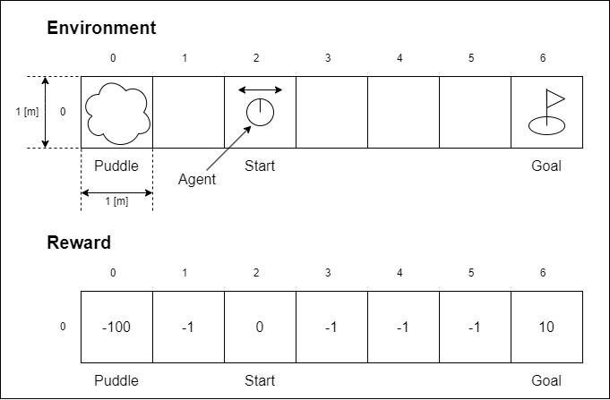
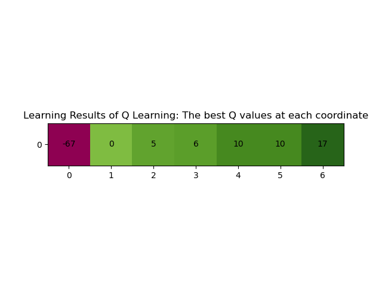

### LICENSE & Reference

#### LICENSE

This repository is licensed under the MIT License.<br>
See the `LICENSE` file for more details.

Copyright (C) 2024 Yusuke Yamasaki. All Rights Reserved.

#### References

To understand the theory and implementation, I referred to the following books and websites.
- 斉藤康毅, “ゼロから作るDeep Learning 4 - 強化学習編”, オライリー・ジャパン, 2022
- 上田隆一, “詳解　確率ロボティクス　Python による基礎あるごりずむの実装”, 講談社, 2020
- ryuichiueda, "slides_marp/prob_robotics_2024", GitHub, https://github.com/ryuichiueda/slides_marp/tree/master/prob_robotics_2024, last viewed on: 2025/1/10
  - And, the content of the lecture using these slides.

In addition, the program to display the images was implemented with reference to the following site.<br>
See the `scripts/q_learning.py` file for more details.
 - matplotlib, "Annotated heatmap", https://matplotlib.org/stable/gallery/images_contours_and_fields/image_annotated_heatmap.html#sphx-glr-gallery-images-contours-and-fields-image-annotated-heatmap-py, last viewed on: 2025/1/10


---

<br><br>

# Q学習の実装

## 処理内容



このプログラムでは、１マスが１[m] x １[m] で１x７個ある環境をエージェントであるロボットが左右に１[m] ずつ移動することを考えます。<br>
エージェントがとれる行動は、１ステップあたり左あるいは右方向に１[m] 進むという２種類のみであり、その場に停止したり２[m] 以上を移動することはできません。<br>
スタート位置である座標 [0, 2] からゴール位置である座標 [0, 6] に最短で移動することを目標として、その目標を達成したときに報酬が最大となるように報酬を設定しています。<br>

報酬は、以下のように決定しました。
- 水たまり（Puddle）はロボットに入ってほしくない場所としているため、水たまりの位置である座標 [0, 0] に入った場合 -100 の報酬を与えます。
- 最短距離でゴールにたどり着いてほしいため、スタート以外で移動するごとに -1 の報酬を与えます。
- ゴールを目指してほしいので、ゴールの報酬を 10 と環境の中で一番高い報酬を与えます。

また、学習の終了条件はエピソード数で判断し、100 エピソード目が終了したら学習を終了します。<br>
ここで、エージェントがスタートからゴールするまでのこと１エピソードとしています。<br>

また、 Q 学習において更新の対象である行動価値関数の Q 値は、全ての位置で０に初期化されています。<br>
学習が進むにつれ、報酬が高ければ Q 値も大きくなり、逆に低ければ Q 値も小さくなります。<br>

本プログラム`scripts/q_learning.py`では、以上の設定を踏まえて強化学習の１つである Q 学習を行い、学習終了後に CLI および GUI で結果を出力します。<br>

## 実行方法

以下のコマンドで実行することができます（Linux系OSの場合）。

```bash
python3 script/q_learning.py
```

## 実行結果

実行することで、学習終了後に以下のような標準出力が得られます（学習結果は実行毎に異なります）。

```bash

----------

[ Q Learning ]

----------

Settings

- Environment: 
      |     0       1       2       3       4       5       6
  ----|------------------------------------------------------------
    0 | [ (0,0) , (0,1) , (0,2) , (0,3) , (0,4) , (0,5) , (0,6) ]
            |               |                               |  
          <Puddle>        <Start>                          <Goal>
                            <= [Agent] =>
  
  - Start : Start Position (0, 2)
  - Goal  : Goal Position (0, 6)
  - Puddle: Big Cost Position (0, 0)

- Agent:
  - Robot (Only left and right movement)

- Reward:
      |     0       1       2       3       4       5       6
  ----|------------------------------------------------------------
    0 | [  -100 ,  -1   ,   0   ,  -1   ,  -1   ,  -1   ,   10  ]

- Learning
  - max episodes: 100
  - episode end conditions: When the agent reaches the Goal
      
----------

Result:

 - best episode number :  5
 - best reward         :  7
 - best places passed  :  [[0, 2], [0, 3], [0, 4], [0, 5], [0, 6]]
 - best policy         :  [[0, 1], [0, 1], [0, 1], [0, 1], [0, -1]]
 - best Q-values       :  [[-67, 0, 5, 6, 10, 10, 17]]

```

これは、学習時の環境やエージェントの設定に加えて学習結果を確認することができます。

また、同時に以下のような図を含むウィンドウが表示されます。



これは、環境である１x７個の各マスに対応した、一番初めに最良であったエピソードの際に得られた Q 値を表示したものになっています。各マスの色は Q 値に対応しています。


以上２つの出力から Q 値の初期値である０と比較して、スタート位置である [0,2] からゴール位置である [0,6] に向かうにつれて Q 値が大きくなり、水たまりの位置である [0,0] では Q 値が大きく減少しています。このことから、スタート位置から右方向に進み続けてゴール位置にたどり着く方策が最適な方策として得られたことがわかります。


## 設定の変更

設定を変更する場合、`scripts/q_learning.py`のコードを直接書き換えてください。書き換えが可能な変数には、`# 変更可能`とコメントを付けています。<br>
以下に、プログラムから変更可能な変数を示します。

```py
    """ line: 36 ~ 73 """

    # 環境のサイズ
    self.env_size_ :tuple[int, int] = (0, 6)  # 変更可能。ただし第１の要素は０のみ可能であり１以上には未対応。報酬の変数と要素数を合わせること

    # 開始位置（＝初期位置）の座標
    self.start_pos_ = np.array([self.env_size_[0], 2])  # 変更可能
    # ゴール位置の座標
    self.goal_pos_ = np.array([self.env_size_[0], self.env_size_[1]])  # 変更可能

    # alfa（過去の忘れにくさ）の定義
    self.alfa = 0.5  # 変更可能。0 <= alfa <= 1 の範囲で設定可能

    # epsilon（ε-greedy方策の、どれだけの確率で探索するかのパラメータ）の定義
    self.epsilon = 0.2  # 変更可能。0 <= epsilon <= 1 の範囲で設定可能

    # 報酬の変数
    self.env_reward_ = np.array([[-100, -1, 0, -1, -1, -1, 10]])  # 変更可能。水たまりの位置は報酬の値で表現。環境のサイズと要素数を合わせること

    # Q値の変数
    self.q_ = np.full((self.env_size_[0]+1, self.env_size_[1]+1), 0)  # 変更可能。np.full()の最後の引数となっている整数部分が初期値であり、ここのみ変更可能

    # 最大episode数の変数
    self.episode_max_ = 100  # 変更可能

```